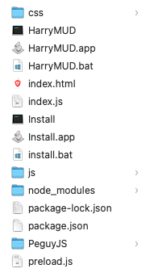
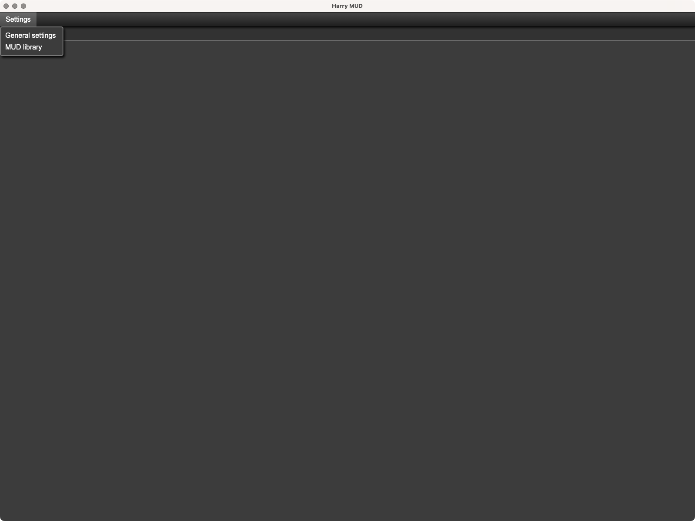
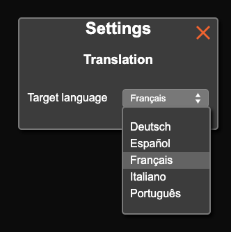
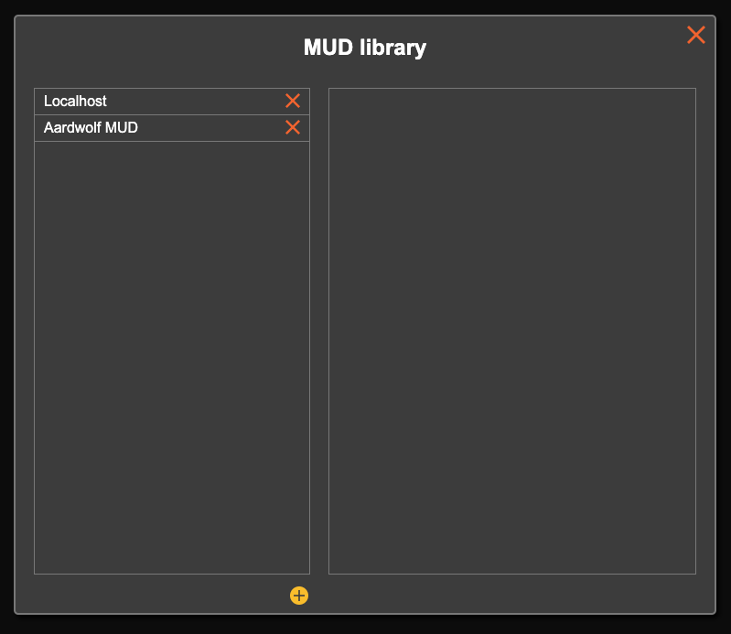
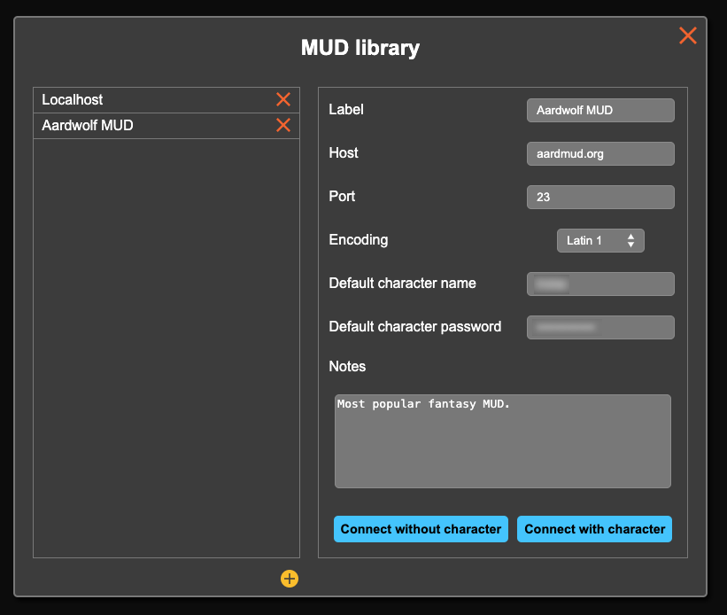
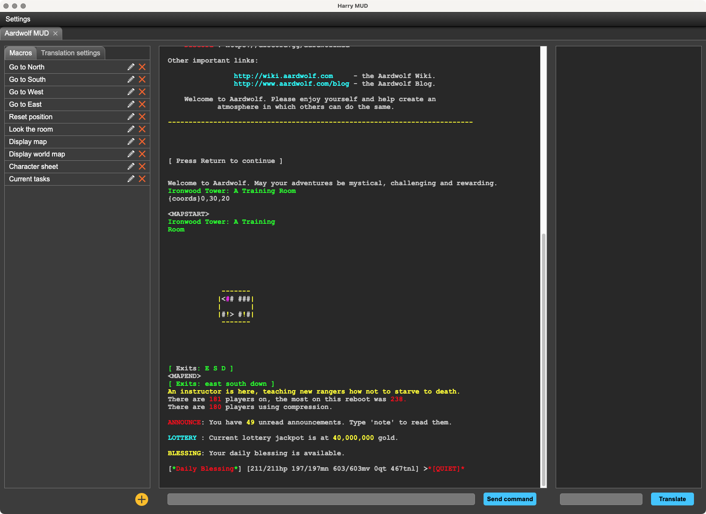
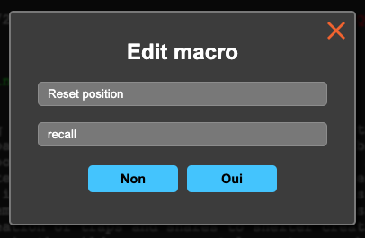
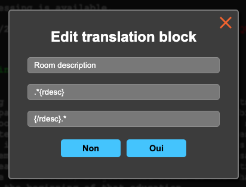
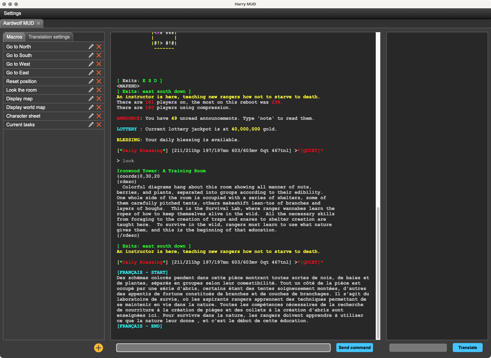
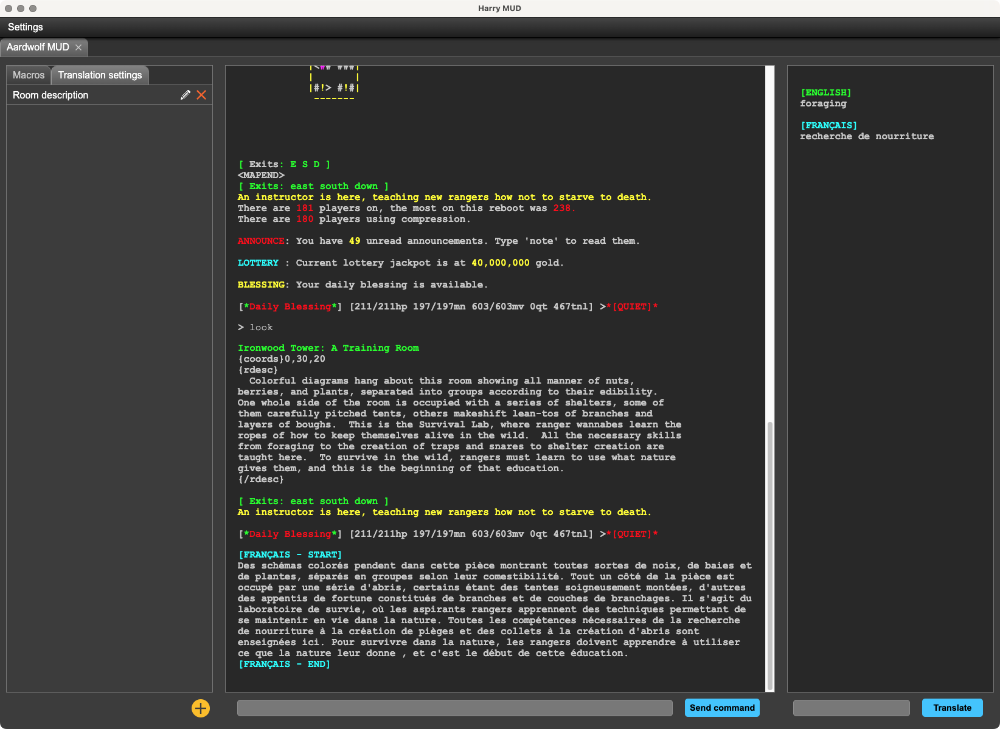

# Harry MUD
Harry MUD is an interface based on [Electron](https://www.electronjs.org/), [Péguy.js](https://github.com/Killfaeh/Peguy.js) and [Google Translate](https://translate.google.fr/?hl=fr&sl=auto&tl=fr&op=translate) for connecting to your favorite MUDs.</br>
It features a library that you can customize with your favorite MUD login info.</br>
You can also save small macros and string patterns to automate the translation of some game parts.</br>
The name HarryMUD is a reference to the Star Trek character Harry Mudd.

## Table of Contents

1. [Installation](#installation)
2. [How to use](#how-to-use)
3. [Where to find MUDs](#where-to-find-muds)

## Installation

### Install Node.js

You need to install Node.js to run Harry MUD.

**Windows**

Download the installation file on Node.js web site : [https://nodejs.org/fr/download/prebuilt-installer](https://nodejs.org/fr/download/prebuilt-installer) </br>
Run it as administrator.

**Mac OS**

Open a terminal. </br>
Install Homebrew if you haven't already.

```bash
/bin/bash -c "$(curl -fsSL https://raw.githubusercontent.com/Homebrew/install/HEAD/install.sh)"
```

Then, install Node.js and npm.

```bash
brew install node
brew install npm
```

**Linux**

Open a terminal and run these 2 commands.

```bash
sudo apt install nodejs
sudo apt install npm
```

### Download and extract the archive

Download the project archive via this Google Drive link : [https://drive.google.com/file/d/1J7beVvjva-_QuuFpPFgADgvlL1OIU8Me/view?usp=sharing](https://drive.google.com/file/d/1J7beVvjva-_QuuFpPFgADgvlL1OIU8Me/view?usp=sharing) </br>
Then, extract it.

<div align="center">
</br>
Archive content
</div>

### Run the application

**Windows**

If you run Harry MUD for the first time, run install.bat (double click).</br>
Then, run HarryMUD.bat (double click).

**Mac OS**

Run HarryMUD.app (double click).</br>
You can put HarryMUD.app in your dock.

**Linux**

Run HarryMUD in a terminal.

## How to use

When you start Harry MUD, you have an empty window with a settings menu.</br>

<div align="center">

</div>

### General settings

In general settings, you can choose the target language for automatic translation.</br>

<div align="center">

</div>

### Add a MUD connection info and play

In the MUD library you can add or select an existing MUD.</br>

<div align="center">

</div></br>

To add a MUD you have to click on the + button. Then you have to complete the fields.</br>

<div align="center">

</div></br>

Then, you can choose to connect to the MUD with or without sending automatically your character login info.</br>

<div align="center">

</div></br>

**Note :** you can connect to several MUD at the same time. Each MUD will be displayed in a dedicated tab.

### Add a macro

To add a macro, you have to click on the + button in the macros tab.</br>

<div align="center">

</div></br>

Enter a name in the first field and the commands list in the second field. Commands must be separated with ; character.</br>
Then, to run the macro, just click on it in the macros list.</br>

This feature is usefull to remember some unusual or complexe commands.</br>
**/!\ Don't try to create bots with it ! /!\\**

### Add auto translation pattern

Harry MUD doesn't translate all the game. It would become unreadable if it was the case.</br>
You have to choose what part of the game to translate automatically by creating some pattern.</br>

To create a translation pattern, click on the + button in the transalation settings tab.</br>

<div align="center">

</div></br>

Then, enter a name in the first field, the start pattern in the second field and the end pattern in the third field.</br>

In this example on the MUD Aardwolf, Harry MUD translate automatically the text between the string {rdesc} and the string {/rdesc}.</br>

<div align="center">

</div></br>

### Occasional translations

Some times you will need to translate some sentences or words which are not in auto translated blocks. </br>
To translate them, you just have to copy paste them in the field at the right bottom and click on the "Translate" button.</br>

<div align="center">

</div>

## Where to find MUDs

[The Mud Connector](https://mudconnect.com/)</br>
[MUD Listings](https://mudlistings.com/)</br>
[reddit](https://www.reddit.com/r/MUD/new/)</br>
